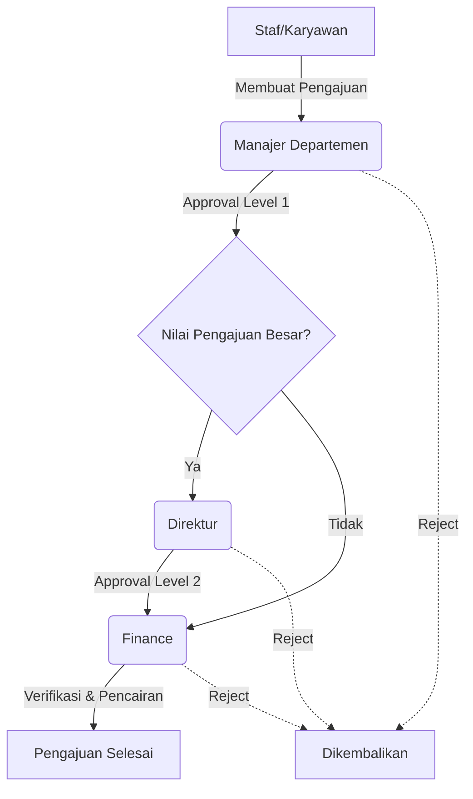

# Struktur Organisasi & Hak Akses (RBAC) - PJH-ERP

Dokumen ini memetakan struktur divisi, peran (*roles*), dan batasan wewenang (*permissions*) yang berlaku di dalam ekosistem PJH-ERP. Sistem ini menggunakan arsitektur *Role-Based Access Control* (RBAC) untuk menjaga keamanan dan privasi data antar divisi.

> [!NOTE]
> Seluruh pengguna di sistem ini secara otomatis memiliki hak akses tingkat dasar (Employee Self-Service) untuk mengajukan permohonan pribadi dan melihat data mereka sendiri.

---

## 1. Divisi Finance & Accounting
**Fokus Utama:** Manajemen arus kas, anggaran, pelaporan keuangan, dan siklus pendapatan.

### Peran (Roles)
- `Finance Manager`
- `Finance Staff` (atau `Staf Finance` / `Finance`)

### Wewenang & Tanggung Jawab
- **Approval & Pembayaran:** Mengakses dan mengeksekusi pembayaran untuk semua pengajuan dana (Reimbursement/Cash Advance) dari seluruh departemen.
- **Anggaran (Budget):** Mengelola penetapan alokasi anggaran dan mengawasi serapan anggaran lintas departemen.
- **Akuntansi & Pajak:** Mengelola Jurnal Umum, Laporan Keuangan (GL, AP, AR), serta pelaporan Tax Center.
- **Revenue & Sales:** Mengatur *Master Data* Pelanggan dan menerbitkan Invoice Penjualan.
- **Payroll:** Terlibat dalam tinjauan dan eksekusi pembayaran *payroll* bulanan.

---

## 2. Divisi Human Resources (HR)
**Fokus Utama:** Manajemen siklus hidup karyawan, penggajian, dan tata tertib.

### Peran (Roles)
- `HR Manager`
- `HR Staff`

### Wewenang & Tanggung Jawab
- **Master Data Karyawan:** Hak penuh untuk menambah, mengubah, atau menonaktifkan akun dan profil karyawan.
- **Kehadiran & Cuti:** Menyetujui/menolak pengajuan cuti secara global, menyesuaikan saldo cuti, dan mengatur Kalender Libur Perusahaan.
- **Kompensasi (Payroll):** Menjalankan kalkulasi *payroll*, mengatur potongan pinjaman karyawan, dan menerbitkan slip gaji.
- **Workflow:** Mengelola *Approval Rules* (Alur Persetujuan) untuk tiap departemen bersama Super Admin.

---

## 3. Divisi Manajemen Eksekutif (BOD & Manajerial)
**Fokus Utama:** Pengawasan operasional, persetujuan strategis, dan kontrol departemen.

### Peran (Roles)
- `Direktur` (BOD / C-Level)
- `Manajer Departemen`

### Wewenang & Tanggung Jawab
- **Level Direktur:**
  - Bertindak sebagai `Approval Level 2` (Final) untuk pengajuan dana berisiko/bernilai tinggi.
  - Memiliki visibilitas 100% terhadap semua pengajuan, anggaran seluruh perusahaan, dan laporan buku besar (GL).
- **Level Manajer Departemen:**
  - Bertindak sebagai `Approval Level 1` untuk staf di dalam satu departemen yang sama.
  - Hanya dapat melihat pengajuan dan serapan anggaran yang terkait dengan departemennya sendiri.

---

## 4. Divisi IT & System Operation
**Fokus Utama:** Infrastruktur sistem, bantuan teknis (Helpdesk), dan administrasi *database*.

### Peran (Roles)
- `Super Admin`
- `IT Support`

### Wewenang & Tanggung Jawab
- **Super Admin (God-Mode):** 
  - Hak mutlak atas konfigurasi sistem (Pengaturan Aplikasi, Sistem Log).
  - Manajemen akses keamanan (Pembuatan Roles & assignment Permissions).
  - Mengelola seluruh *Master Data* inti (Chart of Accounts, Vendor, Jenis Pajak, Aset Tetap).
- **IT Support:** 
  - Bertindak sebagai manajer Helpdesk. Merespons, menugaskan, dan menyelesaikan tiket pengaduan teknis dari karyawan.

---

## 5. Employee Self-Service (ESS)
**Fokus Utama:** Operasional personal staf dan karyawan reguler.

### Peran (Roles)
- `Karyawan`
- `Staf`
*(Catatan: Semua peran dari divisi 1-4 juga mewarisi fungsi ESS ini).*

### Wewenang & Tanggung Jawab
- Membaca pengumuman dan Kalender Perusahaan.
- Membuat permohonan Cuti dan melihat sisa saldo cuti mandiri.
- Membuat permohonan dana (Pengajuan) dan melacak status penyetujuannya.
- Membuka tiket laporan kendala kepada tim IT (Helpdesk).
- **Batasan:** Hanya memiliki akses terhadap data *(view.own)* yang mereka buat sendiri.

---

## Visualisasi Workflow Persetujuan (Contoh)

---

## 6. Konfigurasi Master Pajak & Default COA (Chart of Accounts)
Sistem ini membutuhkan pengaturan *Master Data Pajak* yang terhubung langsung dengan *Chart of Accounts* (COA) / Buku Besar untuk mengotomatisasi pencatatan jurnal perpajakan.

### A. Daftar Master Pajak (Tax Types)
Berikut adalah daftar jenis pajak standar yang dikonfigurasi dalam sistem:

| Kode Pajak | Nama Pajak | Tarif (%) | Tipe Transaksi | Akun GL Default (COA) | Keterangan |
| :--- | :--- | :--- | :--- | :--- | :--- |
| **PPN-IN** | PPN Masukan 11% | 11.00% | Pembelian (*Purchase*) | `1-1005` Piutang PPN | Pajak Masukan yang dapat dikreditkan |
| **PPH23-JASA** | PPh 23 Jasa (2%) | 2.00% | Pembelian (*Purchase*) | `2-2003` Hutang PPh 23 | Pemotongan pajak atas jasa |
| **PPH21-TA** | PPh 21 Tenaga Ahli | 2.50% | Pembelian (*Purchase*) | `2-2002` Hutang PPh 21 | Pemotongan honorarium |
| **PPH42-SEWA** | PPh 4(2) Sewa (10%)| 10.00% | Pembelian (*Purchase*) | `2-2004` Hutang PPh 4 Ayat 2 | Pajak final atas sewa bangunan |
| **PPN-OUT** | PPN Keluaran 11% | 11.00% | Penjualan (*Sales*) | `2-2001` Hutang PPN | Pajak dari tagihan/invoice pelanggan |

### B. Setup Default Akun GL (Chart of Accounts)
Untuk memastikan *posting* jurnal berjalan otomatis tanpa *error*, kode akun berikut **wajib** ada dan dipetakan:

#### Kelompok Aset (Assets)
- `1-1005` **Piutang PPN (VAT Receivable)**
  *Digunakan untuk mencatat PPN Masukan dari vendor/supplier.*
- `1-1400` **Piutang PPh 23 (Prepaid Tax)**
  *Digunakan untuk mencatat pajak dibayar di muka jika perusahaan dipotong PPh oleh pihak lain.*

#### Kelompok Kewajiban (Liabilities)
- `2-2001` **Hutang PPN (VAT Payable)** / `2-1100`
  *Digunakan untuk mencatat PPN Keluaran yang harus disetor ke kas negara.*
- `2-2002` **Hutang PPh 21**
  *Digunakan menampung potongan PPh 21 karyawan/pihak ketiga sebelum disetorkan.*
- `2-2003` **Hutang PPh 23**
  *Digunakan menampung potongan PPh 23 jasa pihak ketiga.*
- `2-2004` **Hutang PPh 4 Ayat 2**
  *Digunakan menampung pemotongan pajak final.*

> [!IMPORTANT]
> Pastikan semua kode akun (`kode_akun`) di atas didaftarkan di menu **Master Data -> Chart of Accounts**, serta terhubung di pengaturan **Master Pajak** sebelum pembuatan transaksi (Pengajuan Dana, Invoice, atau Jurnal Umum).

---

## 7. Pemetaan Kas & Bank (Cash & Bank Mapping)
Untuk memfasilitasi transaksi pembayaran (*disbursement*), penerimaan (*receipt*), dan operasional harian, sistem mensyaratkan beberapa rekening Kas dan Bank dasar yang harus dipetakan ke dalam Chart of Accounts (COA) bertipe **Aset**. 

Berikut adalah konfigurasi standar Kas & Bank yang dipetakan ke COA:

| Nama Kas/Bank | Nomor Rekening | Keterangan / Peruntukan | Akun GL Default (COA) |
| :--- | :--- | :--- | :--- |
| **Bank Masuk** | `000-111-222` | Rekening khusus untuk penerimaan uang masuk / *Inbound* | `1-1101` Bank Masuk |
| **Bank Keluar** | `333-444-555` | Rekening khusus untuk pembayaran tagihan vendor & operasional | `1-1102` Bank Keluar |
| **Bank Payroll** | `123-000-999` | Rekening khusus yang dialokasikan untuk pembayaran gaji karyawan | `1-1103` Bank Payroll |
| **Petty Cash** | `CASH` | Dana tunai untuk operasional harian departemen / *reimbursement* kecil | `1-1100` Kas Kecil (Petty Cash) |

### Jurnal Saldo Awal (Opening Balance)
Saat Kas & Bank pertama kali ditambahkan dengan saldo awal, sistem akan secara otomatis membuat Jurnal Saldo Awal. Jurnal ini akan mendebit akun Kas/Bank bersangkutan dan mengkredit akun modal penyeimbang berikut:

- `3-0000` **Modal Awal (Opening Balance Equity)**
  *Digunakan sebagai akun penyeimbang (kredit) untuk setiap saldo awal kas/bank yang dimasukkan ke dalam sistem.*

---

## 8. Master Data Pendukung Sistem (System Required Accounts)
Sistem memiliki beberapa parameter COA krusial yang berfungsi sebagai "jembatan" atau penampung otomatis saat transaksi dijalankan oleh modul terkait:

### A. Akun Ekuitas & Laba (Equity & Earnings)
- `3-0000` **Modal Awal (Opening Balance Equity):** Dipakai sebagai akun *balancing* otomatis saat penginputan saldo awal kas, bank, atau piutang.
- **Laba Ditahan (*Retained Earnings*) & Laba Tahun Berjalan (*Current Year Earnings*):** (Dibutuhkan untuk *Setup* proses Tutup Buku Akhir Tahun).

### B. Akun Beban & Hutang Gaji (Payroll Clearing)
Saat siklus *Payroll* bulanan di-*Generate* oleh HRD dan di-*Posting* oleh Finance, sistem otomatis memetakan nilai ke akun berikut:
- `6-004` **Beban Gaji (Salary Expense):** Mencatat total biaya gaji perusahaan.
- `2-2005` **Hutang Gaji (Payroll Liabilities):** Akun perantara (*clearing*) sebelum dana benar-benar ditransfer secara fisik dari Bank Payroll ke rekening karyawan.

---

## 9. Struktur Anggaran (Budgeting Hierarchy)
Sistem ERP ini tidak menggunakan *budgeting* tunggal, melainkan berlapis (hierarki) untuk memudahkan kontrol pengeluaran di tiap departemen:
1. **Departemen:** Level kontrol teratas (Contoh: *Finance & Accounting*).
2. **Program Kerja:** Inisiatif/divisi khusus di dalam departemen (Contoh: *Operasional Kantor*, *Proyek Implementasi ERP*).
3. **Pos Anggaran:** *Mapping* yang mengikat Program Kerja dengan **Akun Biaya (COA)**. 
   *(Contoh: Program 'Operasional Kantor' dialokasikan budgetnya secara spesifik ke akun '6-001 Biaya Perjalanan Dinas')*.
4. **Delegasi Anggaran:** Sebuah departemen (misal: IT) diizinkan menggunakan dan menyerap dana dari Pos Anggaran milik departemen lain (misal: Finance) jika diberikan hak akses (delegasi) oleh Admin.

---

## 10. Konfigurasi Standar Cuti (Leave Balances)
Manajemen Cuti diatur terpusat oleh HR. Sistem secara *default* sudah dikonfigurasi dengan tipe dan saldo berikut untuk setiap karyawan:

| Jenis Cuti | Kuota/Saldo Standar | Sifat Pengajuan | Keterangan Khusus |
| :--- | :--- | :--- | :--- |
| **Cuti Tahunan** | 12 Hari | Tanggal Ke Depan | Cuti reguler (Hak dasar) |
| **Cuti Sakit** | 14 Hari | Bisa Mundur (*Backdated*) | Wajib melampirkan surat dokter |
| **Cuti Menikah** | 3 Hari | Tanggal Ke Depan | Hak tambahan, tidak memotong tahunan |
| **Cuti Melahirkan** | 90 Hari | Tanggal Ke Depan | **Khusus Karyawan Perempuan** |
| **Cuti Khusus** | 2 Hari | Bisa Mundur (*Backdated*) | Untuk Kedukaan, Baptis, Khitan, dll. |
| **Unpaid Leave** | 0 Hari / *Bebas* | Tanggal Ke Depan | Cuti di luar tanggungan (potong gaji) |

> [!TIP]
> **Sistem Smart Assignment:** 
> Saat karyawan pria diinput ke dalam sistem, algoritma secara otomatis akan memotong dan merubah saldo *Cuti Melahirkan* mereka menjadi `0` di profil masing-masing, sehingga *form* tersebut tidak bisa mereka akses secara tidak sengaja.

---

## 11. Matriks Persetujuan Dinamis (Approval Workflow Engine)
Sistem dilengkapi dengan mesin *Approval* berbasis *Rules* (Aturan) yang sangat dinamis untuk memproses Pengajuan Dana maupun Cuti.
- **Konsep Multi-Layer:** Persetujuan dapat dikonfigurasi menjadi beberapa tahap (Misal: Layer 1 = Manajer, Layer 2 = Direktur). Setiap departemen dapat memiliki jumlah *layer* yang berbeda.
- **Auto-Routing (Pendelegasian Otomatis):** Dokumen yang dibuat oleh staf akan secara otomatis diarahkan ke kotak masuk (*inbox*) Approver yang tepat di departemennya. Pengguna tidak perlu memilih atasan secara manual.
- **Hierarki Mutlak:** Dokumen tidak akan sampai ke meja divisi *Finance* untuk dibayarkan jika belum menyelesaikan seluruh rantai persetujuan (mencapai status *Fully Approved*).

---

## 12. Jenis-Jenis Pengajuan Dana (Disbursement Types)
Modul *Pengajuan* merupakan urat nadi pencairan kas internal. Sistem membedakan pengajuan ke dalam 3 jenis utama dengan perlakuan jurnal yang berbeda:
1. **Reimbursement:** Klaim pencairan dana atas uang pribadi karyawan yang sudah terpakai untuk keperluan perusahaan (Menciptakan Hutang Perusahaan ke Karyawan).
2. **Cash Advance (Kasbon):** Permintaan uang muka oleh karyawan sebelum kegiatan dilaksanakan (Menciptakan Piutang Karyawan).
3. **Settlement (Pertanggungjawaban CA):** Pelaporan nota/bukti atas Cash Advance. 
   - Jika *Settlement* < *Cash Advance* = Karyawan harus mengembalikan sisa dana.
   - Jika *Settlement* > *Cash Advance* = Perusahaan mencairkan kekurangan dana ke karyawan.

---

## 13. Keamanan Periode & Tutup Buku (Period Closing)
Untuk menjaga integritas laporan keuangan dan audit, sistem menerapkan aturan ketat terkait modifikasi data masa lalu:
- **Period Lock (Kunci Periode):** Fitur yang dipegang oleh Divisi Finance untuk menutup *accounting period* (bulan/tahun tertentu).
- **Anti-Backdate:** Setelah periode dikunci, seluruh pengguna (termasuk *Super Admin*) secara permanen ditolak oleh sistem (*Middleware Blocked*) jika mencoba membuat, mengedit, menghapus, atau membatalkan dokumen (Jurnal, Invoice, Pengajuan, Cuti) dengan tanggal mundur yang jatuh pada periode terkunci tersebut.

---

## 14. Modul Operasional Lainnya (Ops & Assets)
Sistem juga mencakup siklus pengelolaan pihak ketiga dan aset jangka panjang:
- **Siklus Pembelian & Penjualan (P2P & O2C):** Terintegrasi erat dengan *Master Vendor* untuk mengelola Hutang (Account Payable) dan *Master Pelanggan* untuk mengelola Piutang (Account Receivable) melalui penerbitan *Sales Invoice*.
- **Manajemen Aset Tetap (Fixed Assets):** Modul untuk mendaftarkan aset berwujud milik perusahaan. Sistem akan secara otomatis menghitung nilai depresiasi (Penyusutan Aset) secara bulanan dan melemparnya menjadi jurnal biaya penyusutan di Buku Besar.
